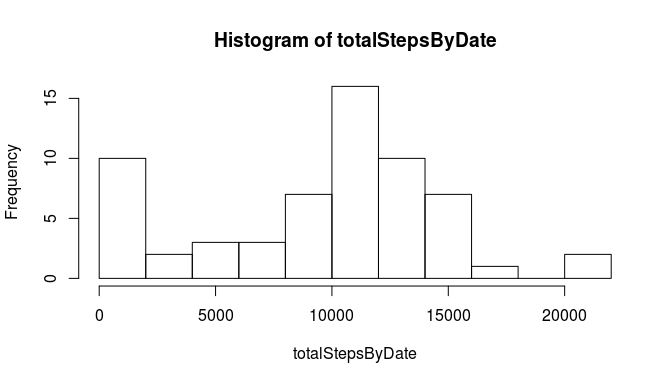
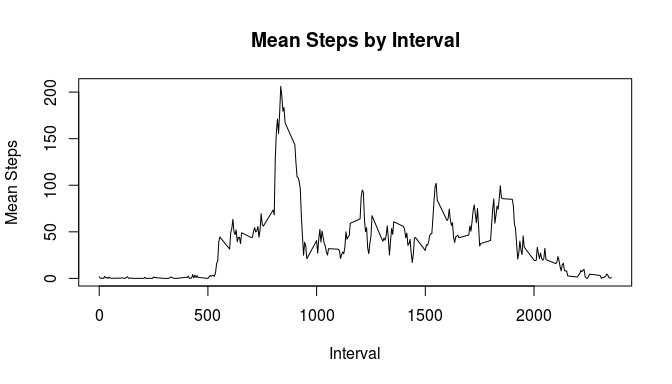
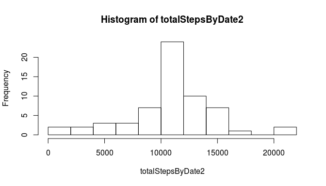
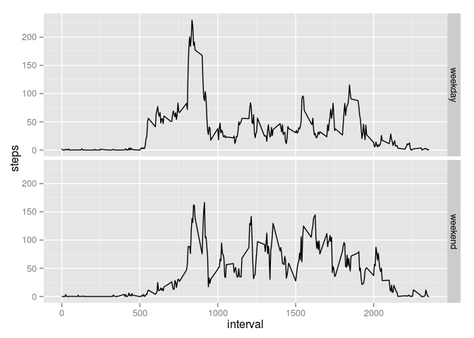

# Reproducible Research: Peer Assessment 1


## Loading and preprocessing the data

Load the data from the local file `activity.csv`. The date column is read as a factor, so we transform it into a date object.


```r
unzip('activity.zip')
act <- read.csv('activity.csv')
act$date <- as.Date(act$date)

str(act)
```

```
## 'data.frame':	17568 obs. of  3 variables:
##  $ steps   : int  NA NA NA NA NA NA NA NA NA NA ...
##  $ date    : Date, format: "2012-10-01" "2012-10-01" ...
##  $ interval: int  0 5 10 15 20 25 30 35 40 45 ...
```

## What is mean total number of steps taken per day?

Total steps by date is calculated by applying sum to the steps column filtered by the date column with missing values removed.


```r
totalStepsByDate = tapply(act$steps, act$date, sum, na.rm=T)
```

The following is a histogram of the distribution of total steps by date.


```r
hist(totalStepsByDate, breaks=11)
```

 

#### Mean and median steps per day

```r
array(c(mean(totalStepsByDate), median(totalStepsByDate)), dim=c(1,2), dimnames=list("steps",c("mean","median")))
```

```
##          mean median
## steps 9354.23  10395
```


## What is the average daily activity pattern?


```r
meanStepsByInt <- aggregate(steps~interval, data=act, FUN=mean, na.rm=T)
```


```r
plot( meanStepsByInt, type="l",
     xlab='Interval', ylab='Mean Steps', main='Mean Steps by Interval')
```

 


```r
maxMeanSteps <- max(meanStepsByInt)
maxMeanStepsInt <- dimnames(meanStepsByInt)[[1]][meanStepsByInt==maxMeanSteps]
```

The interval with the most steps is 288 with an average of 2355 per day.

## Imputing missing values


```r
totalNAs <- sum(is.na(act$steps))
```

There is a total of 2304 (out of 17568) missing values. We will create a new data set and replace all missing values with the mean number of steps for that interval.


```r
act2 <- act

for(i in 1:length(act2$steps)){
    if (is.na(act2$steps[i])){
        act2$steps[i] <- meanStepsByInt$steps[meanStepsByInt$interval == act2$interval[i]]
    }
}
```


The following is a histogram of the distribution of total steps by date with missing values replaced.


```r
totalStepsByDate2 = tapply(act2$steps, act2$date, sum, na.rm=T)
hist(totalStepsByDate2, breaks=11)
```

 

#### Mean and median steps per day (with missing values replaced)

```r
array(c(mean(totalStepsByDate2), median(totalStepsByDate2)), dim=c(1,2), dimnames=list("steps",c("mean","median")))
```

```
##           mean   median
## steps 10766.19 10766.19
```


## Are there differences in activity patterns between weekdays and weekends?


```r
act2$daytype <- 'weekday'
act2$daytype[weekdays(act2$date) %in% c('Saturday','Sunday')] <- 'weekend'

act2$daytype <- as.factor(act2$daytype)
```


```r
require(ggplot2)
```

```
## Loading required package: ggplot2
```

```r
g <- ggplot(act2, aes(x=interval, y=steps)) +
    stat_summary(fun.y=mean, geom='line') +
    facet_grid(daytype ~ .)

g
```

 
